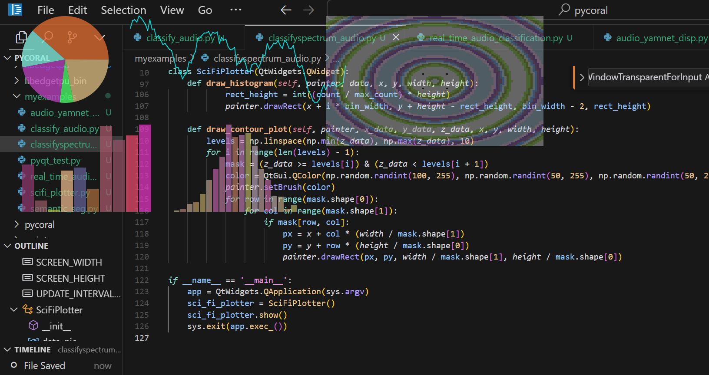

# AetherView

AetherView is a transparent, always-on-top, real-time plotting overlay for a sci-fi aesthetic desktop. Designed to allow mouse interactions to pass through, AetherView lets you view real-time data visualizations without interrupting your workflow. AetherView features vivid colors, transparency effects, and several chart types including pie charts, line series, bar graphs, histograms, and contour plots.



<iframe width="560" height="315" src="https://www.youtube.com/embed/XwqkOcA3pzs" frameborder="0" allowfullscreen></iframe>

## Features
- **Transparent Overlay**: Allows interaction with applications beneath it.
- **Real-Time Data Visualization**: Updates dynamically with dummy data, simulating live data.
- **Multiple Plot Types**: Includes pie charts, line graphs, bar charts, histograms, and contour plots.
- **Sci-Fi Aesthetic**: Features vivid colors, partial opacity, and a futuristic feel.
- **High-Resolution Compatibility**: Optimized for high-resolution screens like the Lenovo Yoga Slim 7i Carbon.

## Installation


## Note
Currently, AetherView is a sample code that can be used by an AI assistant for generating augmented reality dashboards. There is no dedicated library yet, and it is unlikely that one will be created, as the custom components and use cases can be quite varied. Use this as a basis to develop your own tailored AR visualizations.

### Requirements
- Python 3.x
- PyQt5

### Setup
1. Clone the repository:
   ```bash
   git clone https://github.com/ajinkyagorad/AetherView.git
   cd AetherView
   ```

2. Install the required dependencies:
   ```bash
   pip install PyQt5 numpy
   ```

3. Run the application:
   ```bash
   python aetherview.py
   ```

## Usage
AetherView opens as a frameless, transparent widget overlaying your screen, continuously updating with generated dummy data. It allows clicks to pass through, so you can work with other applications underneath the overlay.

### Key Plot Types
1. **Pie Chart**: Displays real-time changing pie slices with random proportions.
2. **Line Series**: A dynamic line graph showing cumulative data.
3. **Bar Graph**: Displays bars of different heights and vivid colors.
4. **Histogram**: Shows the frequency distribution of generated data.
5. **Contour Plot**: A gradient contour plot with multi-colored levels.

### Example Use Cases
- **Real-Time Data Monitoring**: Display live feed data overlaid on your desktop.
- **Visualization Demos**: Use AetherView as a visual aid for presentations with a futuristic aesthetic.
- **Background Analytics**: Monitor system or application data without interrupting workflow.

## Customization
AetherView can be customized by adjusting variables in the code, such as:
- **Colors and Opacity**: Change colors and transparency in the `draw_` functions.
- **Update Interval**: Modify the refresh rate by setting `UPDATE_INTERVAL_MS`.
- **Resolution**: Adjust widget dimensions by setting `SCREEN_WIDTH` and `SCREEN_HEIGHT`.

## Contributing
Pull requests are welcome. For major changes, please open an issue first to discuss what you would like to change.

## License
MIT License. See `LICENSE` file for more information.

---

Enjoy your holographic plotting overlay with **AetherView**!
